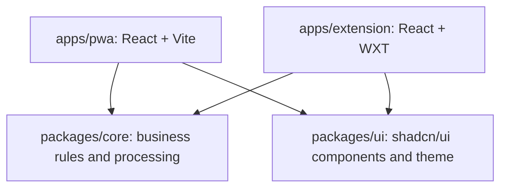

# Architecture

Swiss is a pnpm monorepo with two browser hosts, a shared business library, and a shared UI package. All tool processing happens on the user's device. This document describes the current system; [the architecture decision](docs/adr/0001-web-hosts-feature-core.md) records the reasoning behind the host and core boundaries.

## Dependencies and ownership

Each host owns its feature screens, layout, workspace state, clipboard actions, and platform integration. They share behavior through core and compose shared UI components independently. A tool's React screen and state hook therefore live in each host, while its algorithms and validation live in core.

Core is independent of React, WXT, extension APIs, and host storage. It can use standard browser APIs and browser-compatible libraries. The UI package is independent of core and tool state.

Both hosts compile the shared packages' TypeScript source directly. Core exposes feature subpaths such as `@swiss/core/bcrypt-passwords`; UI exposes component subpaths such as `@swiss/ui/components/input`.

## Repository map

| Location                      | Responsibility                                                     |
| ----------------------------- | ------------------------------------------------------------------ |
| `apps/pwa/src/app/`           | PWA shell, sidebar, and page layout                                |
| `apps/extension/entrypoints/` | Extension background, sidebar/tab entrypoints, and bundled workers |
| `apps/extension/src/`         | Extension shell and layout                                         |
| `apps/*/src/features/`        | Host-specific tool screens                                         |
| `apps/*/src/state/`           | In-memory workspace state and job coordination                     |
| `apps/*/src/platform/`        | Host asset loading, worker creation, and browser integration       |
| `packages/core/src/`          | Feature modules, contracts, processing, and worker engines         |
| `packages/ui/src/`            | Shared shadcn/ui components, theme, and component helpers          |
| `scripts/`                    | Asset preparation, verification, and shared browser-test support   |

Core is organized by feature: `base64`, `json`, `ocr`, `identity-passwords`, `bcrypt-passwords`, and `secret-generation`. Related contracts, implementations, and TypeScript tests stay together. The shared `result.ts` defines the result type for expected validation failures; features own their error codes, and hosts own user-facing wording. Unexpected failures throw.

Identity's C# code lives within its feature at `packages/core/src/identity-passwords/dotnet/`:

- `Swiss.Identity` contains the password-hashing business library.
- `Swiss.Identity.Browser` exposes that library to JavaScript through .NET WebAssembly.
- `Swiss.Identity.Tests` contains native .NET tests.

`Swiss.slnx` groups these projects, and `Directory.Packages.props` manages their NuGet versions. The feature owns both languages because they implement the same tool.

## Processing and workers

| Tool family        | Execution                                                                                          |
| ------------------ | -------------------------------------------------------------------------------------------------- |
| Base64             | Synchronous TypeScript processing                                                                  |
| JSON               | Bounded synchronous TypeScript with strict validation and lossless token rendering                 |
| Secret generation  | Synchronous TypeScript using Web Crypto randomness                                                 |
| OCR                | Processing worker for image decoding/cropping and model validation, with a nested Tesseract worker |
| Identity passwords | Module worker hosting the C# library and .NET WebAssembly runtime                                  |
| Bcrypt passwords   | Dedicated worker running bcryptjs                                                                  |

The host coordinates each operation and renders feedback. Core owns the processing contract and worker lifecycle. Workers initialize lazily when a tool needs them and can be reused after successful work. Each engine permits one active job. Cancellation terminates the worker and, for OCR, its descendants; later work starts a fresh worker. Workspace disposal stops outstanding jobs. Hosts suppress results from superseded inputs.

Vite bundles the PWA's OCR and bcrypt worker entries. WXT bundles extension OCR and bcrypt workers as unlisted scripts, keeping execution on the extension origin. Identity's module worker is copied with its runtime assets so .NET's relative imports work in both hosts.

## Workspace lifetime and extension transfer

Each workspace has a React provider above its tool screens. Switching tools preserves inputs, results, and active jobs. Separate PWA pages, extension sidebars, and extension workspace tabs have independent state. Closing or reloading a workspace clears that state.

Inputs, images, passwords, generated secrets, hashes, and results remain in memory. They are not written to persistent storage, URLs, logs, or remote services. CacheStorage holds offline executable and model assets.

The extension background coordinates browser actions and temporary input delivery. **Open in tab** stages the current tool's inputs in background memory for at most 60 seconds. The destination URL carries an opaque token, consumed once through extension messaging and then removed from the URL. Results are excluded; secret generators transfer options and generate fresh values in the destination workspace. Later edits are independent.

## Offline assets and builds

The PWA uses `vite-plugin-pwa` and Workbox to cache the app shell. OCR and Identity assets load on first use into versioned caches; host loaders verify model/runtime integrity and repair missing or damaged data when online. Once cached, these tools support offline reloads. Browser storage eviction requires an online reload of the affected assets.

The extension bundles its executable assets and English OCR model for first-use offline operation. Base64, JSON, bcrypt, and secret generation need no runtime downloads in either host.

Build preparation copies OCR assets and license notices through `scripts/prepare-web-assets.mjs`, and publishes/copies Identity WebAssembly assets through `scripts/prepare-identity-assets.mjs`. Generated assets and host build outputs are ignored by Git and rebuilt from pinned dependencies. PWA updates require an explicit reload because replacing the page clears workspace state.

## Adding a tool

1. Add business rules, contracts, and processing under `packages/core/src/<feature>/`, then expose a feature subpath. Keep any additional runtime code within that feature.
2. Add each host's screen in `src/features/`, state in `src/state/`, and platform adapters in `src/platform/` as needed. Register the tool with the workspace and sidebar.
3. Compose shared components from `packages/ui`. A component belongs there when it is independent of the tool's business rules and state.
4. Place core TypeScript tests beside the feature implementation and browser checks under each host's `tests/browser/`. Shared browser checks belong in `scripts/`.

For implementation rules, see [web conventions](docs/web.md). For setup, verification, and distribution commands, see [the development guide](docs/development.md). User-facing behavior and limits are in [the tool guide](docs/tools.md).
